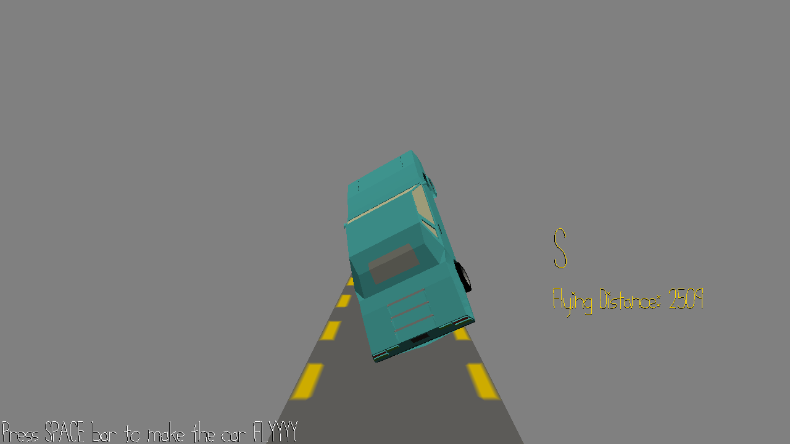

# Bouncy Car
Author: Tianrun Ke

Design: You need to get this car moving. But not simply drive it, you need to bouce it forward! Everytime you bounce the car up, the car would rotate about a random axis(it doesn't make sense, but it looks funny).
Screen Shot:

How To Play:

Press space bar to bounce the car up. You can press space bar even when the car is <b>still</b> in the air so that you can keep the car up and go much further.

Sources: None

This game was built with [NEST](NEST.md).
